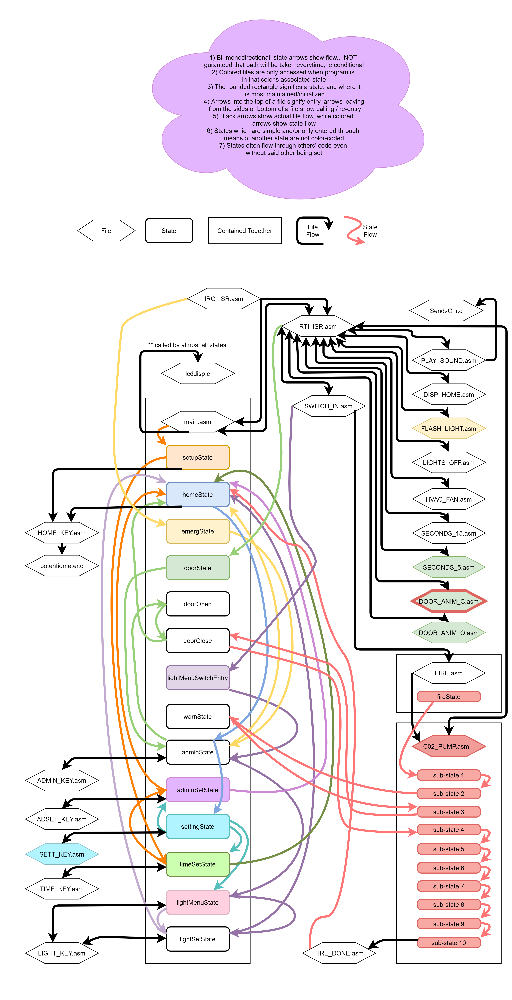

# labControlSystemSimulation
Final project for microprocessors and interfacing class. 84 hours, 10,068 lines of assembly. Request my permission to see the actual code due to plagiarism protection

## Video Demo:

## Flow:

